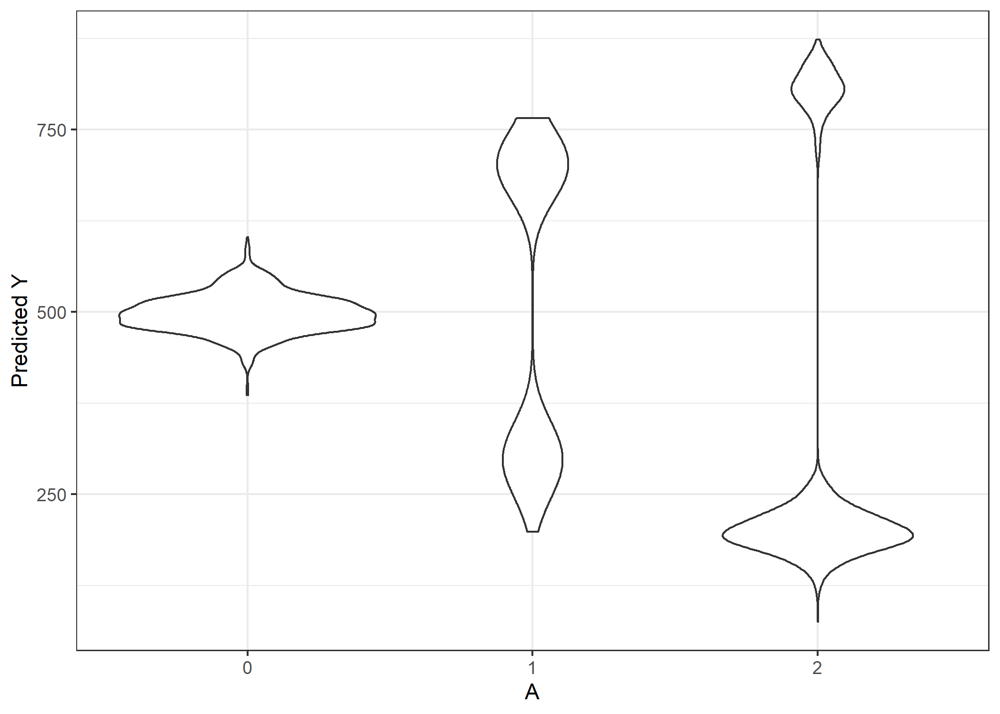

<!-- README.md is generated from README.Rmd. Please edit that file -->

# CERFIT

<!-- badges: start -->
<!-- badges: end -->

The CERFIT R package is an implementation of Random Forest of
Interaction Trees (RFIT) in R. Which is a modification of the random
forest algorithm to estimate individualized treatment effect in
randomized control trials and observational studies. It does this by
modifying the split rule used in the tree growing process. It chooses a
split by maximizing subgroup treatment heterogeneity. It can handle
binary, multiple, ordered, and continuous treatment.

## Installation

You can install the development version of CERFIT from
[GitHub](https://github.com/JustinThorp/CERFIT) with:

``` r
devtools::install_github("JustinThorp/CERFIT")
```

## Example

Below is a small example showing how to fit a Random Forest of
Interaction Trees, get predictions from the tree, and calculate variable
importance. When growing the forest it will print our the response type,
the treatment levels, the type of treatment variable, and an updating
count of the number of trees.

``` r
library(CERFIT)
fit <- CERFIT(Y ~ SAT_MATH + HSGPA + AGE + GENDER + URM | A,
              method = "observation",
              PropForm = "CBPS",
              data = educational,
              ntrees = 30)
#> Continous Response 
#> Treatment Levels: 1 2 3 
#> Multiple Treatment 
#> Tree Number: 10
#> Tree Number: 20
#> Tree Number: 30
ite <- predict(fit)
#> [1] 1 2 3
importance <- MinDepth(fit)
```

``` r
library(tidyverse)
ite %>%
as.data.frame() %>%
pivot_longer(everything()) %>%
ggplot(aes(x = name, y = value)) +
geom_violin() +
scale_x_discrete(labels = c(0,1,2)) +
labs(y = "Predicted Y",x = "A") +
theme_bw()
```


